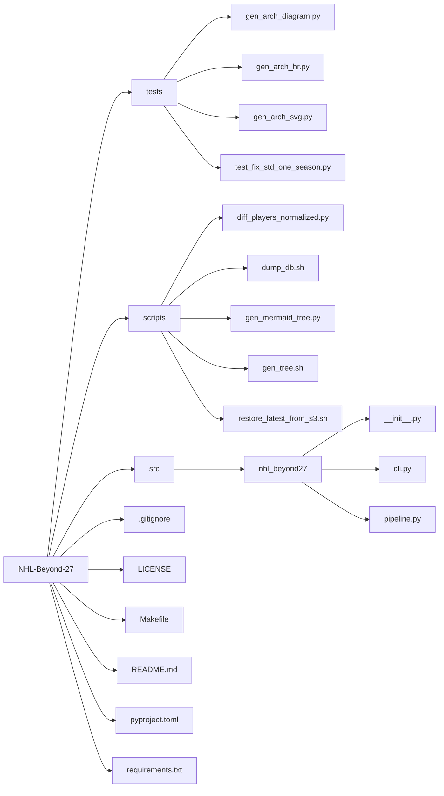

## NHL Beyond 27, the Study

### Motivation
This study is motivated by work from Elijah Cavan, Jiguo Cao, and Tim B. Swartz. Their paper, *NHL Aging Curves using Functional Principal Component Analysis* (published May 2, 2025), analyzes all NHL players from 1920–2022 and “restricts the data to include only player-years 22–34. We also limit the data to players who had an NHL career lasting at least seven seasons. This provides us with 1,785 forwards and 883 defencemen.” Using functional principal component analysis (FPCA), they “observed concave shapes with peaks around 26–28 years,” meaning player performance peaks at roughly age 27.

### Data sources & acquisition

We combine roster/performance, salary, and player metadata from three public sources (accessed September 29, 2025):

- **Hockey-Reference** ([hockey-reference.com](https://www.hockey-reference.com/))  
  *What we used:* season-by-season player stats and game logs used to compute 5-on-5 **Corsi** and TOI thresholds.  
  *How acquired:* scraped via scripted requests with polite rate limiting and caching; normalized player names and captured site player IDs when available.

- **Spotrac** ([spotrac.com/nhl](https://www.spotrac.com/nhl))  
  *What we used:* **cap hit** (capHit) information by player and season for contextual/contract analyses.  
  *How acquired:* scraped team/player pages; parsed contracts to extract season cap hits; mapped to Hockey-Reference players by name + team + season, with manual disambiguation on collisions.

- **Evolving-Hockey** ([evolving-hockey.com](https://evolving-hockey.com/))  
  *What we used:* player reference info (e.g., positions/IDs) to improve **F vs D** labeling and resolve name collisions.  
  *How acquired:* downloaded public player info where available; used as a “key” table when linking across sources.

**Merging & cleaning.**  
- Primary keys: `(player_id_hr OR canonical_name, season)`; secondary checks with team and position.  
- Standardized seasons as `YYYY–YY` (e.g., `2018–19`), age per NHL convention (age on **Feb 1**).  
- Deduplicated aliases, handled diacritics, and reconciled mid-season trades by season-level aggregation.

**Notes.**  
- This project is for research/educational purposes. Respect each site’s terms of service and robots.txt; if you reproduce the pipeline, use sensible rate limits and local caching.  
- Future releases will include a data dictionary and a script to rebuild the curated tables end-to-end.

### Our sample
We restrict our cohort using the following criteria:

1. NHL seasons **2013–14 through 2024–25**  
2. Skaters with **five consecutive** NHL seasons and an **average even-strength TOI ≥ 500 minutes per season**  
3. Goaltenders **excluded**  
4. Player ages **25–29**, inclusive  
5. Final sample size: **282 skaters**

### Performance measure (proxy)
We use **Corsi**—the differential in all shot attempts at even strength—as our primary proxy for a player’s peak and decline. Specifically, we track on-ice 5-on-5 Corsi metrics for each player-season to construct age trajectories.

### Selection bias and era notes
Cavan et al. note selection bias: the imFunPCA method accounts for retention of more skilled players after peak performance. Two caveats for our design: (i) the average NHL career is ~4.5 years, so finding players with five full consecutive seasons is uncommon; (ii) to focus on a consistent modern era, we begin after the 2012–13 lockout, using seasons **2013–14 through 2024–25**. We make no exceptions for the **2019–20 COVID-affected season**.

### Rationale
Our stricter inclusion rules (five consecutive seasons and a minimum even-strength TOI) reduce noise in age-curve estimation by (a) ensuring sufficient within-player data to support functional trajectory modeling, and (b) filtering out low-usage seasons that can distort rate metrics. Using Corsi provides a possession-based, repeatable signal that is less sensitive than points to linemates, special-teams usage, and shooting variance, and is consistently available across the study window. Limiting to **even strength** further mitigates confounds from special-teams deployment. We acknowledge trade-offs: these choices introduce **survivorship bias** (favoring players durable enough to log five straight seasons) and do not fully eliminate contextual effects (quality of teammates/opposition, zone starts, score/venue effects). Nevertheless, they improve comparability across ages and players, yielding more stable estimates of peak and decline for skaters in the modern era.

### Age definition
We follow the NHL convention: a player’s age for a given season is his age on **February 1** of that season (integer years). Thus, a player’s “**age-27 season**” is the season in which he is 27 on February 1. We then use that season’s full **5-on-5 Corsi** metrics.

### Why this choice
- Aligns with NHL roster and public-data standards  
- Keeps each player’s data within a single season (consistent team/linemates/context)  
- Avoids splitting seasons across calendar years

### Position split and weighted scoring

We analyze **forwards** and **defensemen** separately to respect role differences, and we also report a combined, position-adjusted index.

**Position identification.** Skaters are labeled **F** (forwards) or **D** (defensemen) based on their roster position for each season.

**Primary metric.** All position splits use 5-on-5 **Corsi** (even-strength shot attempts). Unless otherwise noted, we use **CF%** (Corsi For percentage).

---

### F/D role weights (for a single combined leaderboard)

When we combine forwards (F) and defensemen (D) into one ranking, we apply a **position-level weight** to reflect strategic value or scarcity by position. This weighting is **separate from Weighted Spicy** (which scales by individual 5v5 TOI).

**Definition.** For player *i* in season *t* with position *p ∈ {F, D}*:

`Score(i,t) = γ_p × Metric(i,t)`, where `Metric ∈ {Spicy, Weighted Spicy}` and `γ_p` is a constant for position *p*.

**Why use role weights?**
- Makes a single, comparable index across positions without ignoring systematic role differences.  
- Encodes study-wide priors (e.g., relative scarcity) without affecting within-position ordering.

**What we use now.** We treat `γ_F` and `γ_D` as **provisional** constants for the study window. They do **not** depend on TOI and are applied **only** at the combination step.

**Future refinement.** We will estimate `γ_F` and `γ_D` from data (e.g., cross-validation to out-of-sample team xG/goal differential, or by matching each position’s marginal contribution to wins) and report sensitivity to alternative priors.

---

#### 🌶️ Spicy (position-adjusted score)

A simple, comparable “how hot was this season?” score within each position and season.

For each season `t` and position `p ∈ {F, D}`:

1. Compute the position-season mean and standard deviation of CF% among skaters meeting the TOI threshold:
   - `μ_{p,t}` = mean CF% for position `p` in season `t`
   - `σ_{p,t}` = std dev of CF% for position `p` in season `t`
2. For player `i`, define the **Spicy score**:
   - `Spicy_{i,t} = ( CF%_{i,t} - μ_{p,t} ) / σ_{p,t}`

**Interpretation.** `0` = position-average; `+1` = one SD above peers in the same position & season.

---

#### 🌶️🌶️ Weighted Spicy (usage-weighted, position-adjusted)

“Spicy,” but scaled by how much the player actually played at 5v5, so big minutes amplify impact.

Let `TOI5_{i,t}` be player `i`’s 5-on-5 minutes in season `t`. Define a usage weight:

- `w_{i,t} = TOI5_{i,t} / median_p(TOI5_{·,t})` (clipped to `[0.5, 2.0]` to avoid extreme leverage)

Then:

- `WeightedSpicy_{i,t} = Spicy_{i,t} × w_{i,t}`

**Interpretation.** Keeps the same “hotness” ordering as Spicy, but credits players who sustain it over larger minutes.

---

#### Reporting

- **By position:** We present Spicy and Weighted Spicy distributions **separately** for forwards and defensemen.
- **Combined index:** For an overall leaderboard, we use **Spicy** / **Weighted Spicy**, which are already position-standardized (so F and D are comparable).

---

#### Why these choices (and what’s next)

- Position-standardizing removes systematic F/D differences, making comparisons fair.
- Usage weighting acknowledges that driving play over more minutes is harder and more valuable.
- **Provisional:** These weights are intentionally conservative. In future work we will estimate **data-driven weights** (e.g., via cross-validation against out-of-sample team xG/goal differential, score/venue/zone-start controls, and quality-of-competition adjustments) to refine both the standardization and the usage scaling.


## Quickstart

### Prerequisites
- Python 3.10+ (tested on 3.13) and `pip`
- A PostgreSQL database you can access (local or remote)
- *(Optional)* AWS creds if you’ll ingest from S3

### Setup
```bash
# clone
git clone https://github.com/ewnike/NHL-Beyond-27.git
cd NHL-Beyond-27

# create & activate a virtualenv (pyenv example)
pyenv virtualenv 3.13.7 nhl_beyond27-3.13.7
pyenv activate nhl_beyond27-3.13.7
# (or: python -m venv .venv && source .venv/bin/activate)

# install the package (editable)
pip install -e .
```
## Download & Restore the Database (from S3)

Pulls the latest dump from `s3://$S3_BUCKET_NAME/backups/`, verifies integrity, and restores it into your local Postgres.

### Prerequisites
- **AWS CLI** configured with a profile that can read the bucket (one-time):
```bash
aws configure --profile nhl-beyond
# Region: us-east-2
```

- **Dump to S3 (maintainer):**
```bash
make db-dump \
  AWS_PROFILE=nhl-beyond AWS_REGION=us-east-2 S3_BUCKET_NAME=ewnike-mads593-nhl \
  PGHOST=127.0.0.1 PGPORT=5432 PGUSER=postgres PGPASSWORD='YOUR_PASSWORD' PGDATABASE=nhl_beyond
```

- **Restore latest from S3 (to nhl_beyond_test):**
```bash
make db-restore \
  AWS_PROFILE=nhl-beyond AWS_REGION=us-east-2 S3_BUCKET_NAME=ewnike-mads593-nhl \
  PGHOST=127.0.0.1 PGPORT=5432 PGUSER=postgres PGPASSWORD='YOUR_PASSWORD' \
  PGDATABASE=nhl_beyond_test TARGET_DB=nhl_beyond_test
```

- **Verify:**
```bash
psql -h 127.0.0.1 -p 5432 -U postgres -d nhl_beyond_test -c "\dt"
```

Swap `YOUR_PASSWORD` for your actual password (keep the quotes).


## Project layout


```

